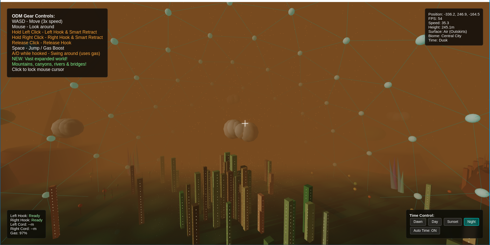

# AttackOnTitan-ODM-Gear

# Omni-directional mobility gear demo

`#javascript` `#browser-game` `#attack-on-titan` `#vide-coding` `omni-direction-mobility-gear`

## Licence 
Creative Commons Attribution-NonCommercial 4.0 International License
This project is licensed under the [Creative Commons Attribution-NonCommercial 4.0 International License](LICENSE.md).
https://github.com/integralyogin/lila_rl/blob/master/LICENSE.md

## Screenshot

  

## Play Online
Play ODMG at: [The Infinite Library](http://theinfinitelibrary.net/games/aot/)

TYPE       NAME                             START   END     LINES
-------------------------------------------------------------------------
function   init                             386     434     49   
function   setupLighting                    436     456     21   
function   updateTimeOfDay                  458     533     76   
function   createCelestialBodies            535     592     58   
function   createMountainRange              594     608     15   
function   createMountain                   610     675     66   
function   createCanyonsAndRivers           677     690     14   
function   createCanyon                     692     756     65   
function   createRiverSystem                758     799     42   
function   createFloatingIslands            802     813     12   
function   createFloatingIsland             815     889     75   
function   createCrystalFormations          891     900     10   
function   createCrystalFormation           902     942     41   
function   createClouds                     944     979     36   
function   createGround                     981     1033    53   
function   getBiome                         1035    1051    17   
function   createCityBuildings              1053    1126    74   
function   createForest                     1128    1168    41   
function   createTree                       1170    1178    9    
function   createPineTree                   1180    1225    46   
function   createDeciduousTree              1227    1277    51   
function   createGeodesicDome               1279    1349    71   
function   createHookTracer                 1351    1393    43   
function   updateClouds                     1395    1410    16   
function   setTimeOfDay                     1413    1420    8    
function   toggleTimeFlow                   1422    1425    4    
function   setupEventListeners              1429    1526    98   
function   jump                             1529    1567    39   
function   shootHook                        1569    1614    46   
function   releaseHook                      1616    1648    33   
function   updateHookUI                     1650    1689    40   
function   checkCollision                   1694    1720    27   
function   checkSingleObjectCollision       1722    1761    40   
function   checkBoxCollision                1763    1835    73   
function   checkCylinderCollision           1837    1883    47   
function   checkConeCollision               1885    1929    45   
function   checkSphereCollision             1931    1972    42   
function   resolveBestCollision             1974    1982    9    
function   checkAndResolveSpawnCollision    1985    2014    30   
function   updateMovement                   2020    2220    201  
function   updateUI                         2222    2240    19   
function   animate                          2245    2299    55 
